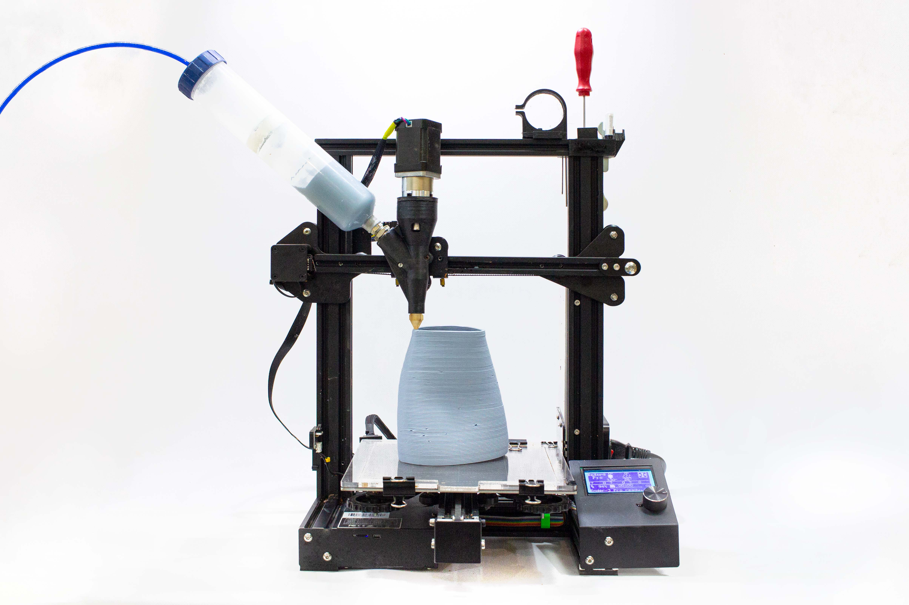
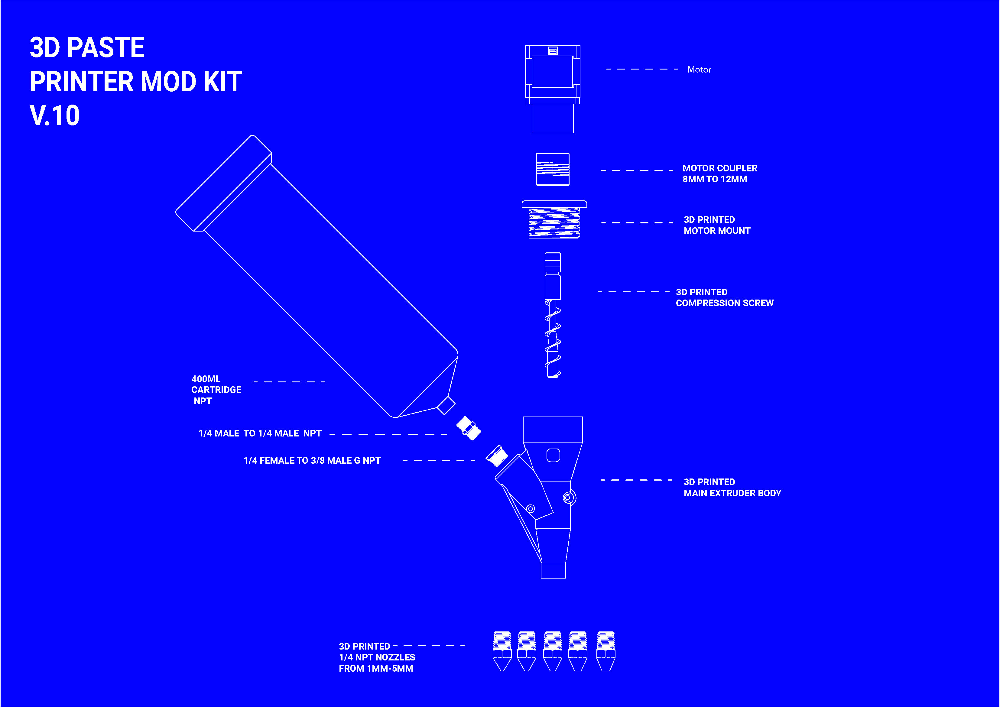
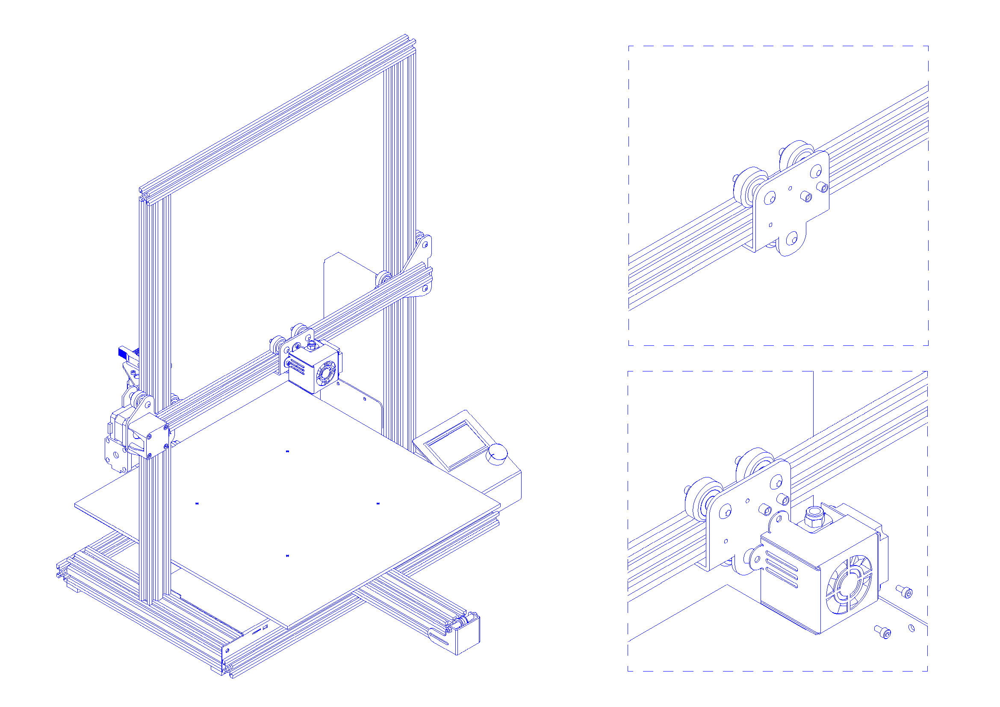
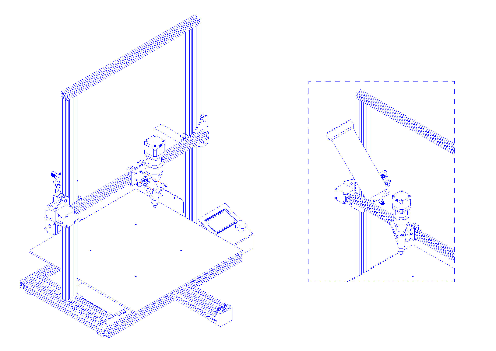
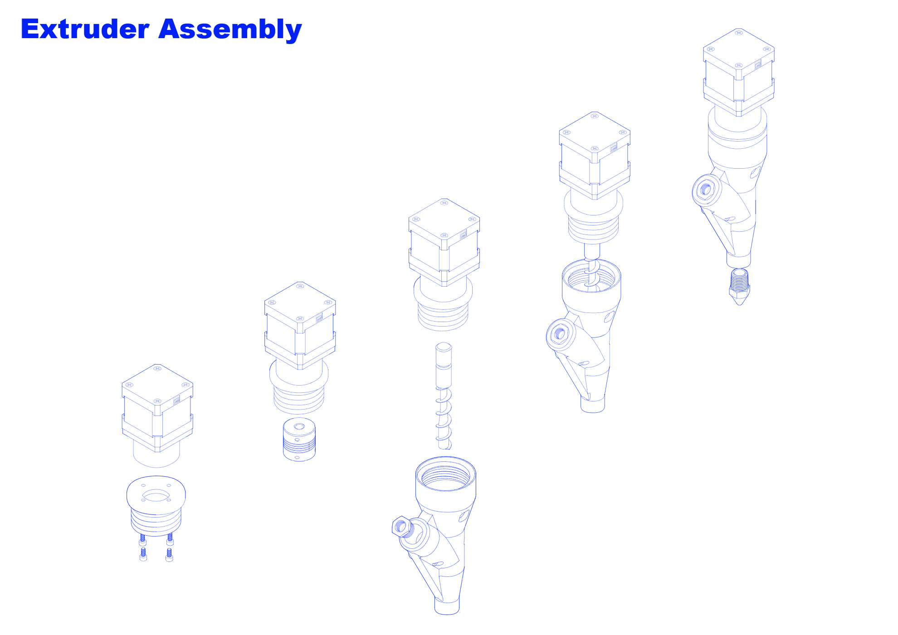
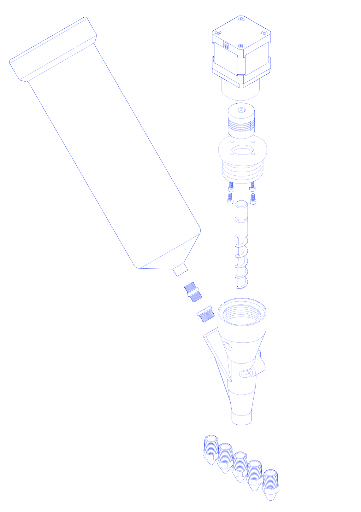

# AEI-CLAB KIT de impresión en Pasta y Biomateriales

Repositorio para el proyecto AEI-CLAB. Entregable de FabLab Barcelona conteniendo el diseño,guías, dibujos de montaje y lista de elemento necesarios para la modificación de una impresora tipo Creality Ender3 para su modificación de impresión de tipo fused deposition modelling (FDM) a pasta .

El sistema funciona con presión de aire para el sistema de alimentación (más seguro, más fácil de configurar y más limpio) y un cabezal extrusor controlado por motor.
- Reducida cantidad de tornilleria, sólo 4 tornillos para un desmontaje completo (más fácil y rápido de limpiar después de terminar el trabajo)
- Cartuchos presurizados de HDPE de grado industrial (200-300 cc) seguros hasta 6,9 bar (la presión de trabajo normal es de 3-4 bar)
- Tornillos extrusores personalizados diseñados en acero inoxidable y chapados para evitar la corrosión.
- Compresor de aire silencioso ~55db con un rango de hasta 6bar y depósito de 3l con válvula de regulación y liberación segura.

### Versión impresa en 3D

- todas las piezas caben en una impresora 3d estándar de 200x200x200 fdm
- casi sin soportes
- tiempo máximo de archivo 12 horas a una altura de capa de 0,3
- menos de 1 kg (un carrete) de material

### Montaje del KIT

### B.O.M

[LISTA DE MATERIALES EN FORMATO XLSX COMPLETA](B.O.M.-PastePrintingPublicVersion.xlsx)

### Montaje Electronica

Si desconecta el cabezal de impresión fdm de la máquina que modifica, deberá colocar una resistencia de 100k ohmios en el lugar donde estaba conectado el termistor del cabezal de impresión (sensor de temperatura).

## Resumen de AEI-CLAB

El objetivo de este proyecto es promover el uso de la tecnología maker y la impresión 3D en el ámbito educativo, utilizando materiales sostenibles y biocompatibles como la pasta de biomateriales.
La impresión 3D es una técnica de fabricación aditiva que permite la creación de objetos tridimensionales a partir de un modelo digital. Esta tecnología está revolucionando diversos campos, desde la industria hasta la medicina y la educación.

El uso de la impresión 3D en la educación permite a los estudiantes desarrollar habilidades técnicas y creativas, así como comprender conceptos científicos y tecnológicos de manera práctica y amena. Además, la utilización de biomateriales en la impresión 3D contribuye a la sostenibilidad y al desarrollo de soluciones innovadoras y responsables con el medio ambiente.
Este proyecto incluye talleres y actividades prácticas dirigidos a estudiantes de nivel secundario y universitario, en los que se enseñan los fundamentos de la impresión 3D y se explorarán las posibilidades de la pasta de biomateriales como material de impresión. Los participantes tendrán la oportunidad de diseñar y fabricar sus propios objetos utilizando esta tecnología, fomentando así su creatividad e innovación.
Esperamos que este proyecto contribuya a la formación de una nueva generación de jóvenes comprometidos con la sostenibilidad y la tecnología, y que promueva el uso de la impresión 3D como herramienta educativa y de innovación.

### Que encontrará en este repositorio:

Este repositorio contiene:

- Archivos de modelos 3d para imprimir [link](3DPrintingFiles).
- Algunas imágenes y visuales del montaje
- Lista de materiales - B.O.M.[Link](B.O.M.-PastePrintingPublicVersion.xlsx)

** Descargas ** * Puedes encontrarlos todos en este repositorio *

### Extras

Le recomendamos que utilice un visualizador Gcode antes de enviar los archivos a la máquina.

Hemos recopilado esta versión minimalista.[LINK TO Gcode WebVisualizer](https://fablabbcn-projects.gitlab.io/cnc-machines/g-code-visualizer/)

## Créditos

Este complemento fue creado por Eduardo Chamorro Martin para FabLab Barcelona en el IAAC (Instituto de Arquitectura Avanzada de Cataluña),en el contexto del programa de ayudas para el apoyo a agrupaciones empresariales innovadoras del Ministerio de Industria, Comercio y Turismo. Convocatoria 2022.

Bajo el proyecto **CLAB: INNOVACIÓN EN PROCESOS DE FABRICACIÓN CIRCULAR Y ABIERTA PARA ENTORNOS EDUCATIVOS**

Partners del proyecto:

- IAAC & FabLab Barcelona
- Fundación Bofill  
- Kid's Cluster
- Abacus cooperativa
- Esteam education
- Anthesis Lavola

## Agradecimientos

- Santi Fuentemilla & Guillem Camprodon por coordinar y apoyar este proyecto.
- Ashkan Foroughi Dehnavi por su arduo trabajo de construcción de lotes probando conocimientos sobre su uso
- Josep Marti por ayudar a probar aproximadamente todas las versiones del mismo.
- Daphne Gerodimou por todo el enorme trabajo de documentación de esto y sus imágenes.

## Contribuciones

Alentamos a que bifurque el proyecto y haga una solicitud con sus contribuciones al proyecto y desarollo de código y hardware libre.

## Licencia
s
Estos diseños son de código abierto bajo licencia de hardware CERN Open Hardware Licence v1.2 para más detalles puedes consultar la [licencia hardware completa](LICENSE-hardware) y licencia GNU GPL v3.0 para software,para más detalles puedes consultar la [licencia software completa](LICENSE-software)
