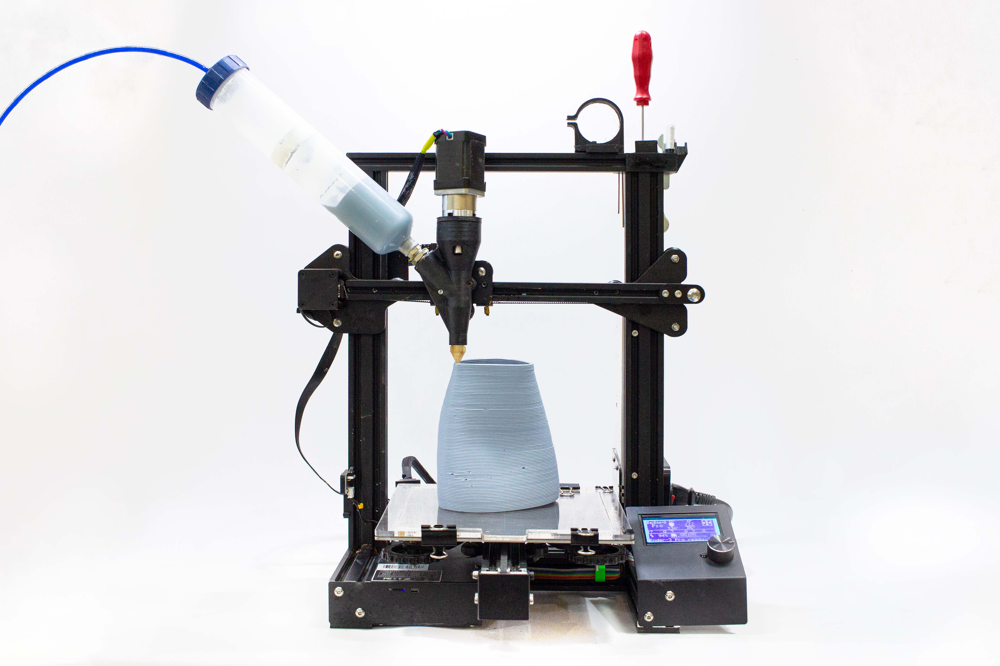
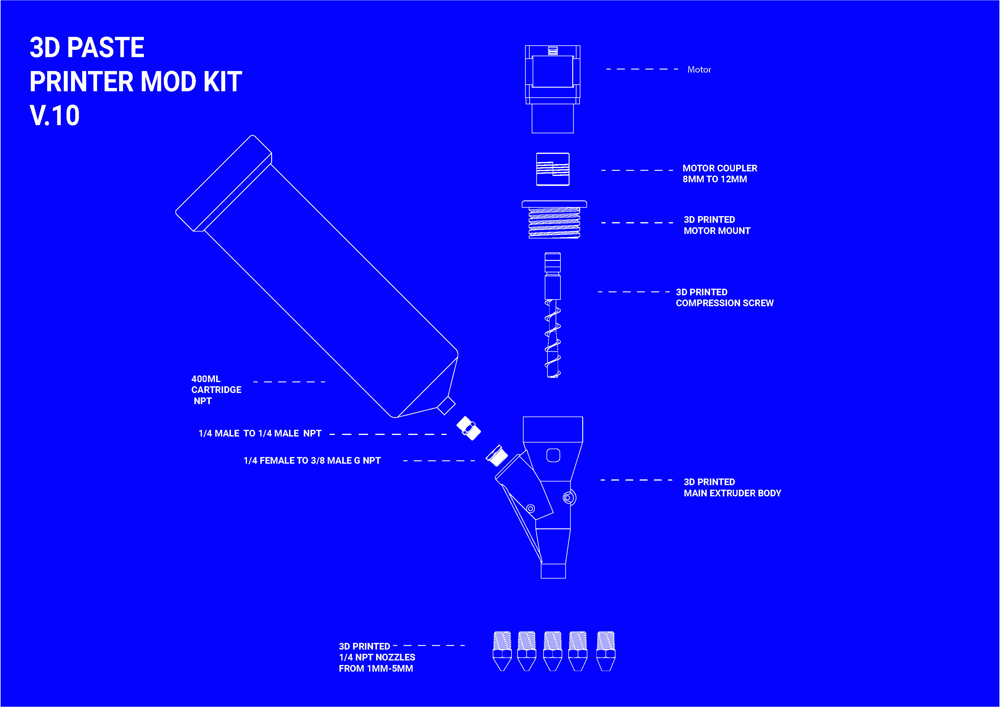
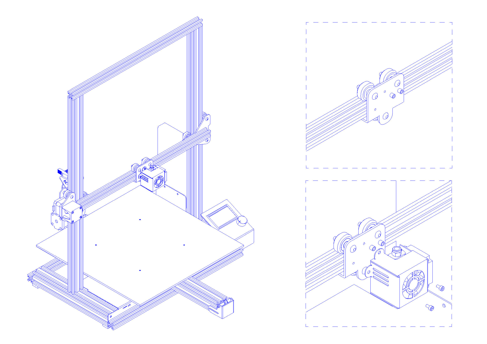
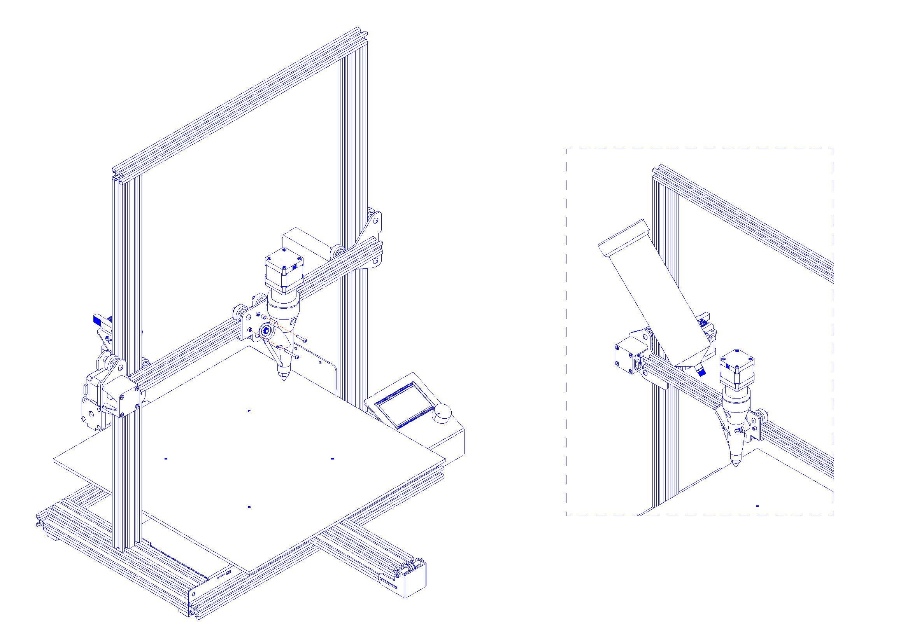
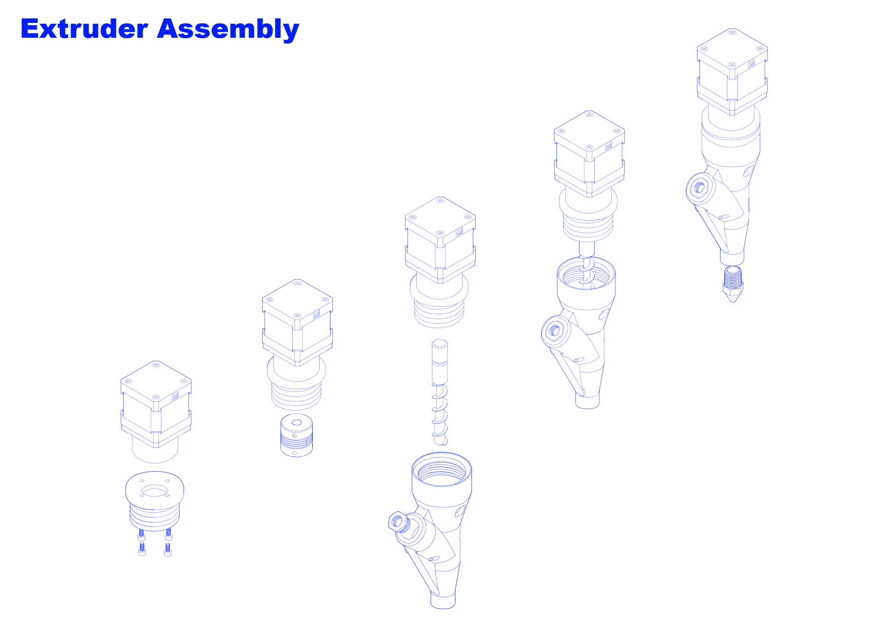
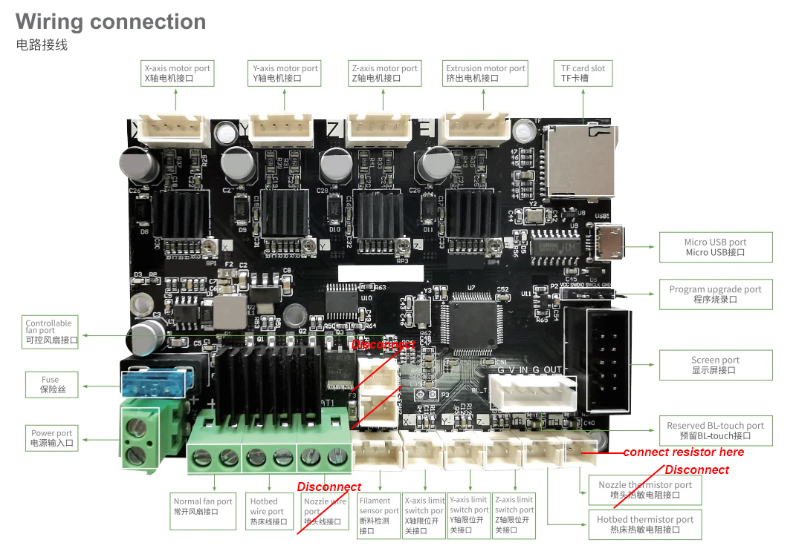
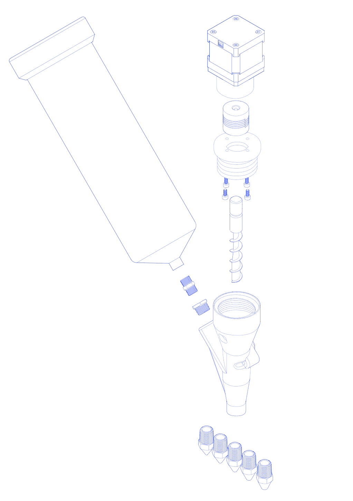

# CLAB Paste and Biomaterials Printing Kit

Welcome to the repository for the [AEI-CLAB](https://fablabbcn.org/projects/clab) project. This deliverable from [Fab Lab Barcelona](https://fablabbcn.org/) contains the design files, assembly guides, schematics, and the Bill of Materials (BOM) required to modify a Creality Ender3 or similar FDM 3D printer into a paste extrusion system.

**Key Features:**

* Air pressure feed for extrusion: safer, easier to configure, and cleaner.
* Minimal hardware: only 4 screws needed for full disassembly, simplifying cleaning.
* Industrial-grade HDPE pressurised cartridges (200–300 cc), rated up to 6.9 bar (typical working pressure: 3–4 bar).
* Custom stainless-steel extruder screws with anti-corrosion plating.
* Silent air compressor (\~55 dB), 6 bar range, 3L tank with regulation and safety release valves.
  
## 3D-Printed Version

* All parts fit within a 200 x 200 x 200 mm standard FDM 3D printer.
* Minimal use of supports.
* Maximum print time: 12 hours (0.3 mm layer height).
* Less than 1 kg of filament required.

## Quick tutorial

👀 Follow along in these video tutorial shows you the ins and outs of safely and effectively using the 3D Printing Machine with #biomaterials and #paste.

📺 https://www.youtube.com/watch?v=jNF1NYnVeio

## Kit Assembly

### Video tutorial

📺 https://www.youtube.com/watch?v=v1bxhi_dhr8

### Pictures

## Bill of Materials (BOM)

Download the complete [BOM in XLSX format](B.O.M.-PastePrintingPublicVersion.xlsx).

## Electronics Setup

If you disconnect the original FDM print head, place a 100k ohm resistor where the thermistor (temperature sensor) was connected.

## About AEI-CLAB

The AEI-CLAB project promotes the use of maker technologies and 3D printing in education, focusing on sustainable, biocompatible materials like biomaterial pastes.

By integrating 3D printing into education, students develop technical and creative skills and gain hands-on scientific and technological understanding. The use of biomaterials fosters sustainable and innovative solutions.

The project offers workshops and activities for secondary and university-level students, combining digital design with biomaterials printing to boost creativity, innovation, and environmental awareness.

## Repository Contents

This repository includes:

* [3D printable files](3DPrintingFiles)
* Assembly images and schematics
* [Bill of Materials (BOM)](B.O.M.-PastePrintingPublicVersion.xlsx)

## Downloads

All files are available in this repository.

## Extras

Before printing, we recommend checking your files using a G-code viewer.

Try this minimalist [G-code Web Visualizer](https://fablabbcn-projects.gitlab.io/cnc-machines/g-code-visualizer/).

## Credits

Project developed by Eduardo Chamorro Martin for Fab Lab Barcelona at IAAC (Institute for Advanced Architecture of Catalonia) under the 2022 call for Innovative Business Cluster Support by the Ministry of Industry, Commerce and Tourism.

Project title: **CLAB: Innovation in Circular and Open Manufacturing Processes for Educational Environments**

**Partners:**

* IAAC & Fab Lab Barcelona
* Fundación Bofill
* Kid's Cluster
* Abacus Cooperativa
* Esteam Education
* Anthesis Lavola

## Special Thanks

* Santi Fuentemilla & Guillem Camprodon for coordination and support.
* Ashkan Foroughi Dehnavi for construction and testing.
* Josep Martí for helping test multiple iterations.
* Daphne Gerodimou for extensive documentation work and visuals.

## Contributions

We welcome contributions! Feel free to fork the repository and submit pull requests with improvements or new features.

## License

Hardware: [CERN Open Hardware Licence v1.2](LICENSE-hardware)
Software: [GNU GPL v3.0](LICENSE-software)

---

**Spanish version:**

# CLAB Kit de Impresión en Pasta y Biomateriales

Bienvenido al repositorio del proyecto [AEI-CLAB](https://fablabbcn.org/projects/clab). Este entregable de Fab Lab Barcelona contiene los archivos de diseño, guías de montaje, esquemas y la Lista de Materiales (BOM) necesarios para modificar una impresora FDM tipo Creality Ender3 en un sistema de extrusión de pasta.

**Características principales:**

* Sistema de alimentación por presión de aire: más seguro, fácil de configurar y limpio.
* Poca tornillería: solo 4 tornillos necesarios para el desmontaje completo, facilitando la limpieza.
* Cartuchos presurizados de HDPE de grado industrial (200–300 cc) seguros hasta 6,9 bar (presión de trabajo típica: 3–4 bar).
* Tornillos extrusores personalizados en acero inoxidable con recubrimiento anticorrosión.
* Compresor silencioso (\~55 dB), rango de 6 bar, depósito de 3L con válvulas de regulación y seguridad.

## Versión Impresa en 3D

* Todas las piezas caben en una impresora 3D estándar de 200 x 200 x 200 mm.
* Uso mínimo de soportes.
* Tiempo máximo de impresión: 12 horas (altura de capa de 0,3 mm).
* Menos de 1 kg de filamento necesario.

## Tutorial rápido

👀 Sigue este vídeo tutorial para aprender, de forma segura y eficaz, a utilizar la máquina de impresión 3D con **biomateriales** y **pasta**.

📺 https://www.youtube.com/watch?v=jNF1NYnVeio

## Montaje del KIT

### Video tutorial

📺 https://www.youtube.com/watch?v=v1bxhi_dhr8

### Fotos

## Lista de Materiales (BOM)

Descarga la [Lista de Materiales completa en formato XLSX](B.O.M.-PastePrintingPublicVersion.xlsx).

## Montaje Electrónico

Si desconectas el cabezal de impresión FDM original, debes colocar una resistencia de 100k ohmios donde estaba conectado el termistor (sensor de temperatura).

## Sobre AEI-CLAB

El proyecto AEI-CLAB promueve el uso de tecnologías maker y la impresión 3D en educación, enfocándose en materiales sostenibles y biocompatibles como las pastas de biomateriales.

La impresión 3D en entornos educativos permite a los estudiantes desarrollar habilidades técnicas y creativas, además de comprender conceptos científicos y tecnológicos de forma práctica. El uso de biomateriales impulsa soluciones innovadoras y responsables.

El proyecto ofrece talleres y actividades para estudiantes de nivel secundario y universitario, combinando el diseño digital con la impresión de biomateriales para fomentar la creatividad, la innovación y la conciencia ambiental.

## Contenidos del Repositorio

Este repositorio incluye:

* [Archivos imprimibles en 3D](3DPrintingFiles)
* Imágenes de montaje y esquemas
* [Lista de Materiales (BOM)](B.O.M.-PastePrintingPublicVersion.xlsx)

## Descargas

Todos los archivos están disponibles en este repositorio.

## Extras

Antes de imprimir, te recomendamos visualizar tus archivos G-code.

Puedes usar esta versión minimalista del [Visualizador Web de G-code](https://fablabbcn-projects.gitlab.io/cnc-machines/g-code-visualizer/).

## Créditos

Proyecto desarrollado por Eduardo Chamorro Martin para Fab Lab Barcelona en el IAAC (Instituto de Arquitectura Avanzada de Cataluña) en el marco de la convocatoria 2022 de ayudas a Agrupaciones Empresariales Innovadoras del Ministerio de Industria, Comercio y Turismo.

Título del proyecto: **CLAB: Innovación en Procesos de Fabricación Circular y Abierta para Entornos Educativos**

**Partners:**

* IAAC & Fab Lab Barcelona
* Fundación Bofill
* Kid's Cluster
* Abacus Cooperativa
* Esteam Education
* Anthesis Lavola

## Agradecimientos

* Santi Fuentemilla & Guillem Camprodon por la coordinación y apoyo del proyecto.
* Ashkan Foroughi Dehnavi por el trabajo de construcción y pruebas.
* Josep Martí por ayudar a probar varias versiones.
* Daphne Gerodimou por el extenso trabajo de documentación y visuales.

## Contribuciones

¡Te animamos a contribuir! Puedes bifurcar el repositorio y enviar pull requests con mejoras o nuevas funcionalidades.

## Licencia

Hardware: [CERN Open Hardware Licence v1.2](LICENSE-hardware)
Software: [GNU GPL v3.0](LICENSE-software)
